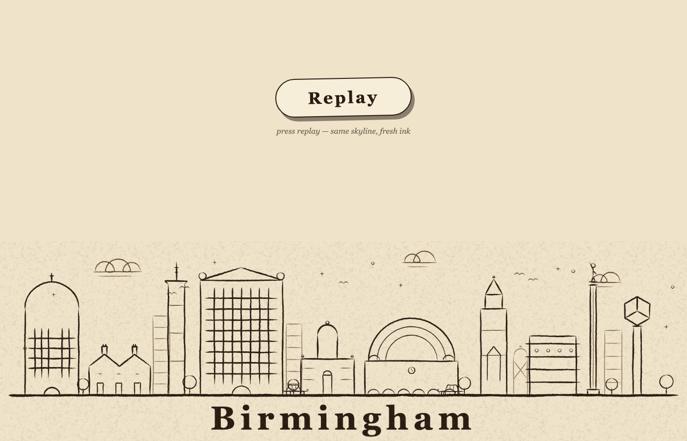

# Birmingham draws itself

A blank page with a **Start** button. Press it and the Birmingham skyline hand-inks itself along
the footer: a ground rule sweeps across, ten landmarks draw themselves one travelling pen-stroke at
a time (Rotunda, back-to-backs, BT Tower, the Colmore block with its two corner orbs, St Philip's,
New Street's train shed, St Martin's steeple, the Library's stacked rings, the Chamberlain column
with its raised-arm statue, and the Cube), then trees, clouds, doodles and two little cars fill the
scene and a bold serif **Birmingham** wipes in underneath.

Made with the [procedural-film](https://github.com/g-h-miles/skills/tree/main/skills/procedural-film)
pipeline — every pixel is computed in plain browser JavaScript from the FILM engine (no images, no
SVG, no CSS animation), on a 100 bpm beat grid.



## Run it

Just open `index.html` — no build, no dependencies:

```
open index.html
```

or serve the folder: `python3 -m http.server` and visit the printed URL.

## Layout

```
index.html            the page: Start button + footer canvas
src/core.js           FILM runtime: registry, timeline reader, renderFrame, grain post
src/lib.js            hand-ink primitives (inkPath, hatching, rng, easing)
src/timeline.js       the beat grid: bpm 100, one 13.2 s footer shot
src/scenes/01-skyline.js   all skyline geometry, built once, drawn from (t) only
src/page.js           the footer player (start / replay / reduced-motion)
tools/                the film toolchain: snap.cjs renders frames, pagecheck.cjs tests the page
docs/                 contract, art bible, storyboard
```

## Tooling (optional)

```
cd tools && npm install
node tools/snap.cjs --shot skyline --samples 8 --sheet   # contact sheet into .frames/
node tools/pagecheck.cjs                                 # headless page test
```

MIT — see LICENSE.
